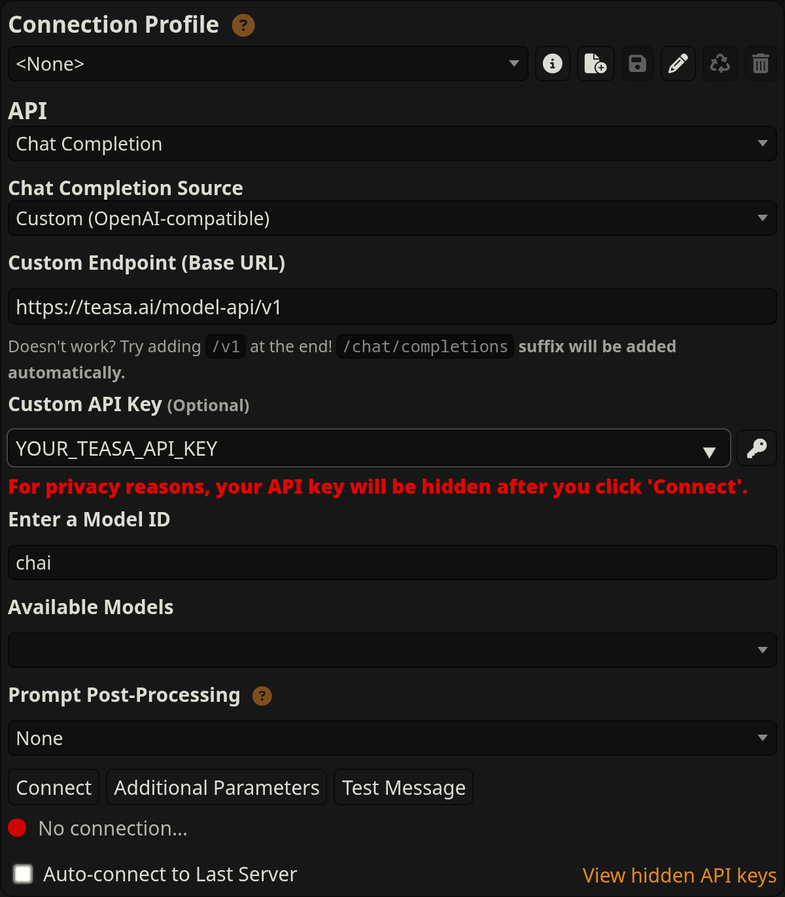
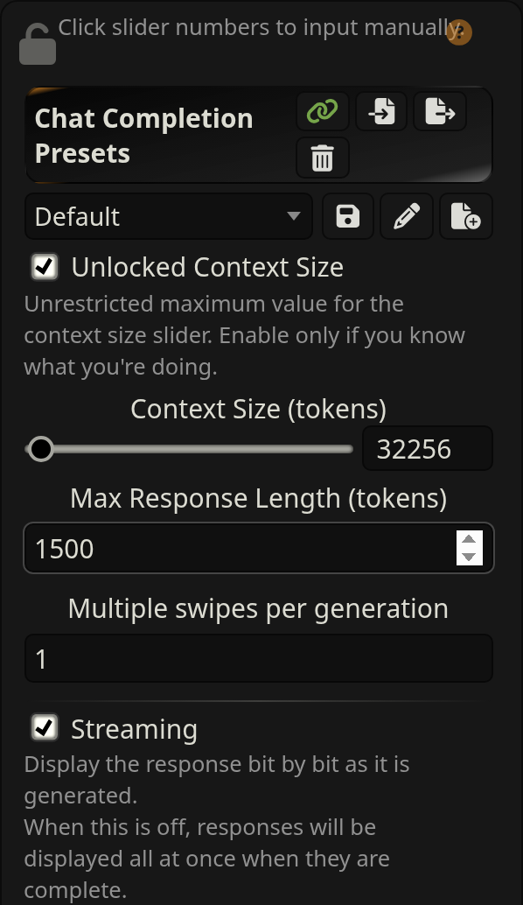
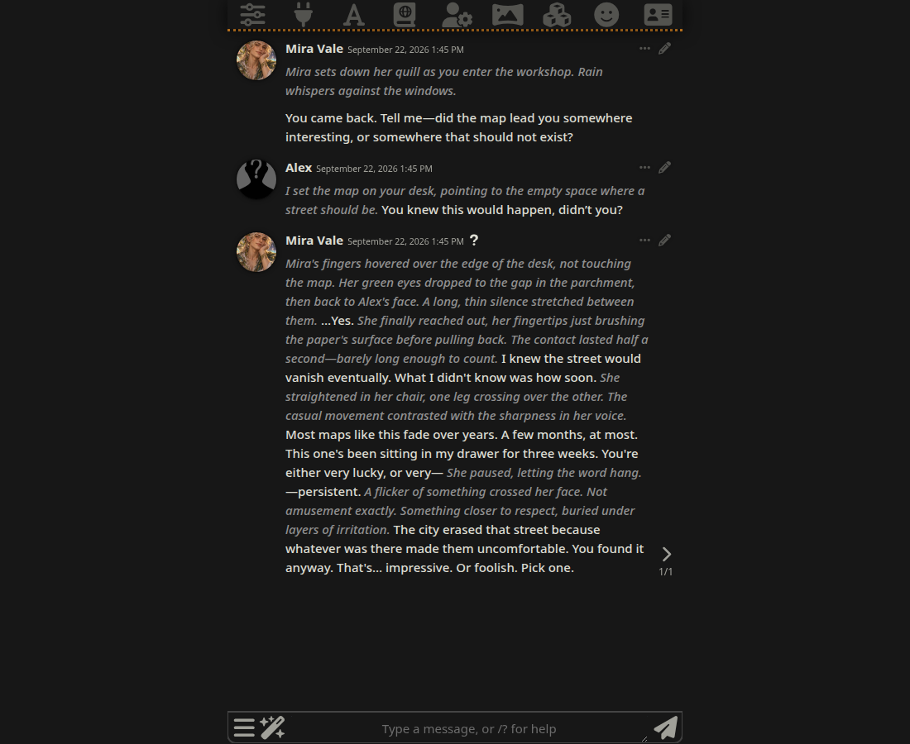

# Teasa for SillyTavern

Use [Chai by Teasa](https://teasa.ai) with your characters and conversations in SillyTavern. Start with a one-time **$1 trial per eligible Teasa account**. No card charges or automatic top-ups.

## Meet the models

| Model | Conversation style | This API trial |
| --- | --- | --- |
| **Chai** | Warm and light conversations with a touch of spice. | Available as `chai` |
| **Matcha** | Deep and rich conversations with a touch of bittersweet. | Not included |

**This experiment is Chai-only.** Trial keys cannot access Matcha. Chai is the new name for the default model previously called Teasa. Existing keys keep their remaining credit; there is no need to replace them.

## Do I need to install the adapter?

**No.** When you connect to Teasa’s hosted API, the adapter runs automatically on our server, including during streaming. SillyTavern receives ready-to-render Markdown: italic narration, bold character names, and action/dialogue formatting. No extension or local proxy is needed.

If you do not have SillyTavern yet, follow its [official installation guide](https://docs.sillytavern.app/installation/) for your operating system, then return here. This repository is not a SillyTavern extension; do not install its URL through the Extensions panel. The optional [standalone formatter](#for-developers-standalone-formatter) is for developers working with raw model output.

## Connect in SillyTavern

1. Sign in at [teasa.ai](https://teasa.ai). Open **Account → Use Teasa in SillyTavern**, create a named API key and save it. If Teasa gave you a trial key, use that key directly.
2. In SillyTavern, open **API Connections** using the plug icon in the top toolbar. Choose **Chat Completion**, then **Custom (OpenAI-compatible)**.
3. Enter these settings and connect:

| Setting | Value |
| --- | --- |
| Custom Endpoint (Base URL) | `https://teasa.ai/model-api/v1` |
| Custom API key | Your Teasa API key |
| Enter a Model ID | `chai` |
| Context size | `32256` tokens, including the reply |
| Response length | Start with `1500` tokens |
| Streaming | Supported |

The screenshot shows the fields **before clicking Connect**. Replace `YOUR_TEASA_API_KEY` with your own key. SillyTavern calls the field “Optional,” but Teasa requires it. Leave **Prompt Post-Processing** set to **None**.



4. Open **AI Response Configuration** using the sliders icon in the top toolbar. Set **Context Size** to `32256`, **Max Response Length** to `1500`, and **Multiple swipes per generation** to `1`. Enable **Unlocked Context Size** if needed to enter that context value. Enable **Streaming** for replies to appear as they are generated.



These setup screenshots use SillyTavern 1.19.0. Field placement can vary by version and theme.

5. Select a character and send a message. You can also import a Character Card V2 PNG or JSON exported from Teasa’s web Creator Studio.

Use the base URL above without adding `/chat/completions`. Leave tool calling, image input and structured JSON output off. [Full setup, credit details and troubleshooting](docs/sillytavern-setup.md).

If you previously selected `teasa-roleplay`, reconnect and choose `chai`. The old ID remains an alias for Chai; it does not unlock another model.

Do not apply the adapter again to hosted API replies.

## See it in SillyTavern

A live reply from the model now named Chai in SillyTavern 1.19.0 using its standard chat display. The example uses a fictional cartographer, Mira Vale: actions appear in italics, dialogue stays upright, and the character header shows who is speaking.



[View the mobile-width screenshot](docs/images/sillytavern-mobile.png). Captured on 22 September 2026 from a real streamed reply through the previous `teasa-roleplay` model ID (now `chai`); the sample conversation is synthetic. Your theme and formatting extensions can change its appearance.

## For developers: standalone formatter

This repository also contains the streaming formatter used by Teasa. It converts raw speaker blocks into one Markdown assistant message: narrator paragraphs become emphasis, character names become bold, and character actions keep their Markdown. SillyTavern renders the resulting text.

The formatter runs locally with no network calls or runtime dependencies. It is useful when integrating a raw Teasa-format stream into another client. It does not include model weights, inference hosting, billing or account services.

```sh
git clone https://github.com/teasaai/sillytavern-adapter.git
cd sillytavern-adapter
npm ci
npm test
npm run demo
```

These installation commands are only for the standalone developer formatter. It is not published as an npm registry package. Requires Node.js 20 or later. The build emits JavaScript and TypeScript declarations in `dist/`.

```js
import { SillyTavernAdapter } from './dist/index.js';

const adapter = new SillyTavernAdapter();
let markdown = adapter.push('Narrator: Rain taps the glass.\n\n');
markdown += adapter.push('Mira: *She lowers her voice.* Stay.');
markdown += adapter.push('', true); // Flush once when the reply ends.
console.log(markdown);
```

[Streaming integration and format contract](docs/adapter.md). [Hosted API example](examples/completion.mjs).

## Compatibility

The formatter was extracted from Teasa’s 22 September 2026 production implementation without changing its behavior. The hosted API was tested with SillyTavern 1.19.0 for model discovery, JSON/SSE completions and Markdown rendering. Other versions and custom regex extensions may behave differently.

This project is maintained by **Teasa <hello@teasa.ai>**. SillyTavern is a separate project. For its connection controls, see the [official SillyTavern documentation](https://docs.sillytavern.app/usage/api-connections/openai/).
